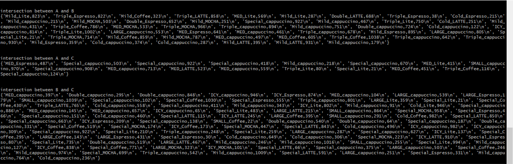
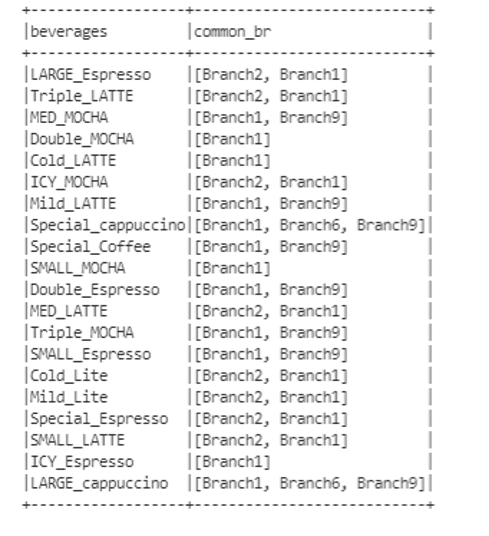
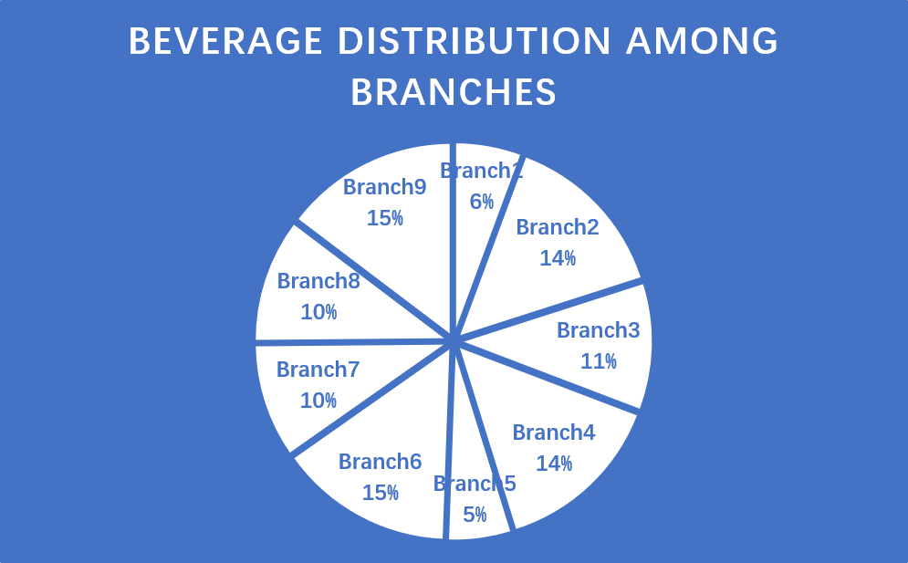
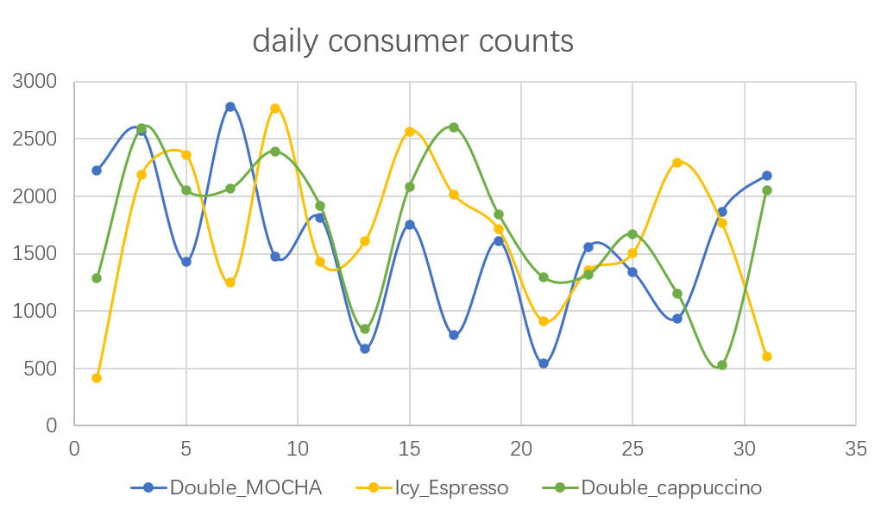

# BEVERAGES CONSUMER ANALYSIS

## Summary:
This project lets you query into 3 Consumer Counts data for 54 coffee beverages sold across 9 branches. You are given a menu, from where you can query into the statistics of the beverages and consumer counts, including the most popular beverages on each branch, the common beverages across different branches, and total consumer counts. 

### Data Problems:
1. Replicas in the consumer counts files.

2. Calculation of total beverage counts cannot be divided into different branches without overlapping.

## Sample Results:

Programs and tools used:
1. VScode
2. Scala/Spark/Hive
3. Python
